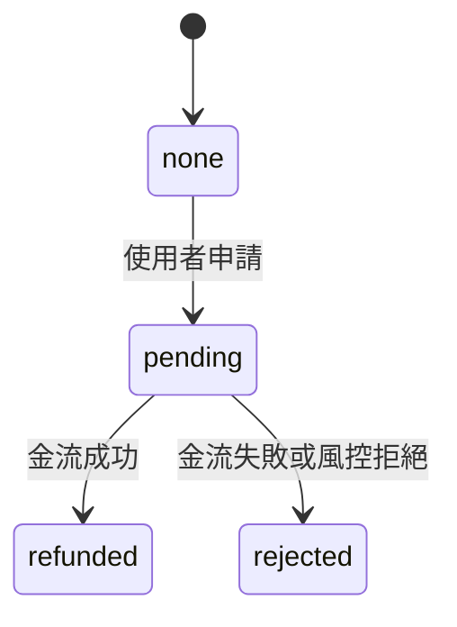

# Spec Template

## Applicability

- Applies to: `spec-writer` agent、`apply-template` skill、`validate-spec` skill

## Rule Content

### CRITICAL：禁止推論

spec 內容**只能**來自筆記字面寫的事實，禁止下列任何形式的推論：

- 業界標準 / 技術預設值（密碼 hash 用什麼演算法、token 多長、API 回傳格式）
- 「合理」時間 / 數值（沒寫的 timeout、size 限制、retry 次數）
- 邏輯延伸（A 推導 B 推導 C）
- URL / 路徑 / endpoint 命名
- 索引、外鍵 ON DELETE 行為、tablespace、charset
- 任何 acceptance criteria 中的時間 / 性能數字（除非筆記明寫）

筆記沒寫但章節必要 → 寫 `偵測不到此內容（筆記未涵蓋：{具體缺什麼}）`。
筆記寫了但細節缺 → 寫 `待補充：{具體缺什麼}`。
兩種標記都必須出現在章節 10 的清單。

### 模板結構

所有 spec 文件必須包含下列 10 個章節，順序固定。必要 = 8 個、選填 = 2 個。

```markdown
# {Feature Name}

> **狀態**：Draft / In Review / Approved
> **最後更新**：{YYYY-MM-DD}
> **來源筆記**：{列出處理的 notes/ 檔案}

## 1. Context
## 2. User stories
## 3. Current state
## 4. Requirements
## 5. Data mapping
## 6. UI / 畫面行為（選填）
## 7. API / 介面（選填）
## 8. Acceptance criteria
## 9. Out of scope
## 10. Open questions / 待補充
```

### 章節 1：Context

**目的**：讓讀者 30 秒內理解「為什麼要做這件事」。

**內容**：
- 問題陳述：目前遇到什麼困難 / 機會
- 開發目的：這次要解決什麼
- 1-2 段文字，不條列

**範例**：
```markdown
## 1. Context

目前使用者遇到退款需求時，必須聯絡客服人工處理，平均等待 2 個工作天。
客服每日處理退款單約 80 件，形成人力瓶頸。

本次開發目標：讓使用者在訂單詳情頁自助發起退款，系統自動判斷退款資格並處理，
預期可減少 70% 人工客服負荷，縮短使用者等待時間至 24 小時內。
```

### 章節 2：User stories

**目的**：明確誰會用這個功能、用來做什麼。

**格式**：`As a {角色}, I want {動作}, so that {目的}`

**範例**：
```markdown
## 2. User stories

- As a 消費者，I want 在訂單詳情頁直接申請退款，so that 我不用打客服電話等待。
- As a 客服人員，I want 在後台看到自動處理的退款記錄，so that 我可以專注處理特殊案件。
```

### 章節 3：Current state

**目的**：描述現況流程 / 現有資料，讓工程師知道改動的起點。

**內容**：
- 現有流程文字描述（1-3 段）
- 非線性流程 → 畫 Mermaid flowchart
- 現有相關資料表列表

**範例**：
```markdown
## 3. Current state

目前退款流程：使用者聯絡客服 → 客服登入後台 → 手動建立退款單 → 打金流 API → 更新訂單狀態。


現有資料表：
- `orders`：訂單主表（無退款相關欄位）
- `customer_tickets`：客服工單（含退款類型）
```

### 章節 4：Requirements

**目的**：工程師可直接對照實作的需求清單。每條包含觸發、行為、邊界。

**格式**：

```markdown
### R{n}. {需求標題}

**觸發**：{什麼情況下發生}
**預期行為**：{系統應該怎麼反應}
**邊界 / 錯誤**：
- {邊界條件 1}
- {錯誤情況 1 + 處理}
```

**範例**：
```markdown
### R1. 使用者發起退款申請

**觸發**：使用者在訂單詳情頁點擊「申請退款」按鈕
**預期行為**：
- 系統檢查訂單是否符合退款資格（見 R2）
- 符合 → 開啟退款原因輸入對話框
- 不符合 → 顯示原因並禁用按鈕

**邊界 / 錯誤**：
- 訂單已退款 → 按鈕隱藏
- 訂單超過 7 天 → 按鈕 disabled，顯示「已超過退款期限」
- 網路錯誤 → Toast 顯示「網路異常，請稍後再試」
```

### 章節 5：Data mapping

**目的**：畫面欄位到資料庫欄位的完整對應，工程師開工必備。

**格式**：

```markdown
## 5. Data mapping

### 涉及資料表

| 表名 | 用途 | 變更類型 |
|---|---|---|
| orders | 訂單主表 | 新增欄位 |
| refunds | 退款記錄 | 新表 |

### 欄位對應表

| 畫面欄位 | DB 表.欄位 | 型別 | 約束 | 說明 |
|---|---|---|---|---|
| 退款原因 | refunds.reason | VARCHAR2(500) | NOT NULL | 使用者輸入，最多 500 字 |
| 退款金額 | refunds.amount | NUMBER(10,2) | NOT NULL, CHECK (amount > 0) | 不可超過訂單原金額 |
| 退款狀態 | orders.refund_status | VARCHAR2(20) | NOT NULL DEFAULT 'none', CHECK IN ('none','pending','refunded','rejected') | 列舉值 |

### 新增 / 修改欄位

**新增**（Oracle SQL 語法）：

```sql
ALTER TABLE orders ADD (
  refund_status VARCHAR2(20) DEFAULT 'none' NOT NULL,
  CONSTRAINT chk_orders_refund_status
    CHECK (refund_status IN ('none','pending','refunded','rejected'))
);
```

**修改**：無

**新表**：
- `refunds`（欄位定義略 — 完整 DDL 開工時確認）
```

**SQL 方言固定為 Oracle SQL**。所有 spec 中的 DDL / DML 範例一律採 Oracle 語法（`VARCHAR2`、`NUMBER`、`CHECK` 約束、`SEQUENCE` + `TRIGGER` 替代 auto-increment）。**禁止使用** MySQL 的 `ENUM` / `AUTO_INCREMENT`、PostgreSQL 的 `CREATE TYPE` / `SERIAL`，以免工程師誤套。

資料表多且有關聯 → 可附 `erDiagram`。

### 章節 6：UI / 畫面行為（選填）

**何時放**：筆記明確提到畫面元件、狀態、互動。筆記完全沒提 → 整章省略。

**內容**：
- 畫面結構（元件列表）
- 狀態機 / 狀態轉換（複雜時用 `stateDiagram-v2`）
- 互動細節

**範例**：
```markdown
## 6. UI / 畫面行為

### 訂單詳情頁新增元件

- 「申請退款」按鈕（置於訂單資訊區右下）
- 退款狀態標籤（若已有退款記錄）

### 退款對話框

- 退款原因（textarea，必填）
- 退款金額（唯讀，顯示訂單金額）
- 「送出」按鈕 / 「取消」按鈕

### 狀態轉換


```

### 章節 7：API / 介面（選填）

**何時放**：筆記提到需要新 API、介接第三方、或有明確 request/response 格式。

**格式**：

```markdown
## 7. API / 介面

### POST /api/orders/{id}/refund

**Request**：
```json
{
  "reason": "string, max 500"
}
```

**Response 200**：
```json
{
  "refund_id": "string",
  "status": "pending"
}
```

**Errors**：
- 400 `INVALID_ORDER_STATE` — 訂單不符退款資格
- 409 `ALREADY_REFUNDED` — 已退款
```

### 章節 8：Acceptance criteria

**目的**：明確的驗收條件，工程師知道「完成」的標準。

**格式**：Given/When/Then 或條列式可驗證條件。

**範例**：
```markdown
## 8. Acceptance criteria

### AC1. 符合退款資格的訂單可申請退款
- Given: 訂單狀態為 "completed" 且建立時間 < 7 天
- When: 使用者點擊「申請退款」
- Then: 開啟退款對話框

### AC2. 不符合退款資格的訂單按鈕禁用
- Given: 訂單建立時間 > 7 天
- When: 使用者瀏覽訂單詳情
- Then: 「申請退款」按鈕 disabled，顯示「已超過退款期限」

### AC3. 退款送出後 3 秒內返回結果
- Given: 使用者填完退款原因
- When: 點擊「送出」
- Then: 3 秒內返回成功或錯誤訊息（不可無回應超過 3 秒）
```

**禁止**：「系統應正確運作」「體驗流暢」「效能要好」這類無法驗證的敘述。

### 章節 9：Out of scope

**目的**：明確界定「本次不做」，避免後續爭議。

**內容來源（嚴格遵守禁止推論紅線）**：

- 筆記**明寫**「不做」「下期再做」「先不處理」「out of scope」的項目 → 列入
- 筆記**明寫**「本次只做 A、B、C」→ 隱含的「不做 D、E」可列入，但每項要附 `(來源：{筆記檔名}「本次只做 X」)` 說明
- 筆記**完全沒提**的「合理應該排除」項目 → **禁止列入**（屬於推論違規）

筆記沒提「out of scope」相關內容時 → 章節 9 寫：

```markdown
## 9. Out of scope

偵測不到此內容（筆記未明寫範圍界限）。建議補充哪些功能本次不做，避免後續爭議。
```

**格式**：條列式。每項加 `(來源：...)` 標示出自哪份筆記哪句話。

**範例**：
```markdown
## 9. Out of scope

- 部分退款（來源：notes/refund/meeting.md「本次只做全額退款」）
- 客服人工介入流程（來源：notes/refund/meeting.md「不改動現有後台」）
```

### 章節 10：Open questions / 待補充

**目的**：彙整所有未解問題、待使用者補充的資訊、來源筆記清單。

**格式**：

```markdown
## 10. Open questions / 待補充

### 待補充

- [ ] 退款金流失敗時的重試機制（筆記未提）
- [ ] 退款通知 email 文案
- [ ] 客服後台是否要顯示自動退款記錄

### 來源筆記

本 spec 依據下列筆記生成：
- notes/refund/meeting-2026-04-15.md
- notes/refund/ui-mockup-notes.md
- notes/refund/spec-draft.pdf       ← 經 markitdown 轉檔，列原始檔
- notes/refund/data-table-draft.md
```

**「來源筆記」清單只列原始檔案路徑**（使用者實際丟進 `notes/` 的檔案）。**禁止列 `.spec-writer/converted/` 路徑**——那是 markitdown 轉檔的內部 cache，使用者不會也不該看到。

## Violation Determination

- spec 缺少必要章節（1-5, 8-10 任一）→ Violation
- 章節順序與定義不符 → Violation
- 資料對應未用表格（散文敘述）→ Violation
- Acceptance criteria 使用「正確運作 / 體驗良好 / 效能佳」類不可驗證敘述 → Violation
- 待補充使用 `TBD` / `TODO` 而非 `待補充：{原因}` → Violation
- 必要章節 ≥ 5 個只有 `待補充` 字樣仍寫檔 → Violation（應回 `INSUFFICIENT_DATA`）
- Mermaid 節點用中文但未包 `["..."]` → Violation
- 選填章節在筆記無相關內容時仍硬塞 `待補充` 而未省略 → Violation
- 章節 10「來源筆記」列出 `.spec-writer/converted/...` 路徑 → Violation（應列原始檔案）
- 章節 5 DDL / DML 使用非 Oracle 語法（如 `ENUM`、`AUTO_INCREMENT`、`SERIAL`、`CREATE TYPE`）→ Violation
- spec 內出現筆記未提及的時間 / 數值 / 演算法 / URL / endpoint 名稱 / 約束細節（屬於推論）→ Violation
- 必要章節缺資訊但未標 `偵測不到此內容` 或 `待補充`，而是寫了合理推論的內容 → Violation
- 章節 10 未彙整所有 `偵測不到此內容` 與 `待補充` 項目 → Violation
- 章節 9 列出筆記未明寫的「合理排除項」（屬於推論）→ Violation
- 章節 9 條目未附 `(來源：...)` 標示出處 → Violation

## Exceptions

- 章節 6、7 為選填：筆記完全無相關內容時，**整章省略**（而不是寫 `待補充`）。
- 新增資料表的完整 DDL 可省略細節、標示「開工時確認」，不視為違規。
